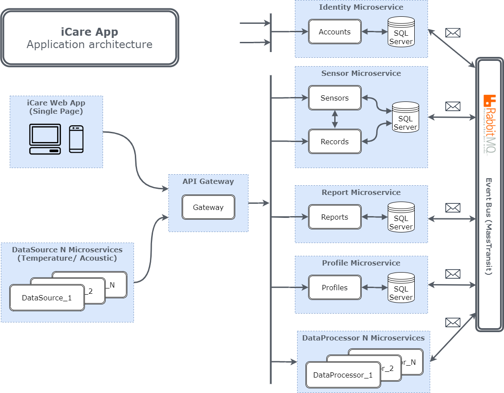

# iCare-Microservices


The main idea of the application is to develop medical web-applicacation based on microservices for patients health care.
Application contains web service for user management and the set of services to simulate the sending of medical telemetry data to server.
Services for data storage & processing are simple CRUD microservices.

## Getting Started

To run the application, type the following commands from the app root directory:

```
> docker-compose build
> docker-compose up
```

For Mac Os or Linux systems, use `sudo` for command above.
To know more about docker-compose, please visit [docker official site](https://docs.docker.com/compose/).

## Architecture overview

The reference application is cross-platform and can run on Windows, Linux or Mac OS. A microservice-oriented architecture with multiple standalone microservices (simple CRUD) is used.

The Http protocol is used for communication between web application and microservices. Communication across multiple microservices is based on the Event Bus with commands & events. The reference application uses the [MassTransit](https://masstransit-project.com/) event bus with [RabbitMQ](https://www.rabbitmq.com/) message broker.



## Microservices

The microservices in the application are completely independent and are not aware of the existence of other microservices.

- [x] [API Gateway](./ApiGateway/README.md)
- [x] [Sensor Microservice](./Services/Sensor/README.md)
- [x] [DataProcessor Microservice](./Services/DataProcessor/README.md)
- [x] [Identity Microservice](./Services/Identity/README.md)
- [x] [Profile Microservice](./Services/Profile/README.md)
- [x] [Report Microservice](./Services/Report/README.md)
- [x] [Event Bus](./EventBus/README.md)
- [x] [Data Source](./DataSource/README.md)
- [x] [Web App](https://github.com/aslamovyura/iCare-single-page-app)

## Built with

- [ASP.NET Core 3.1](https://docs.microsoft.com/en-us/aspnet/core/)
- [Microservices](https://docs.microsoft.com/en-us/dotnet/architecture/microservices/)
- [Clean architecture](https://docs.microsoft.com/en-us/dotnet/architecture/modern-web-apps-azure/common-web-application-architectures)
- [CRUD](https://docs.microsoft.com/en-us/iis-administration/api/crud)
- [REST API](https://restfulapi.net/)
- [Docker](https://www.docker.com/)
- [Entity Framework Core](https://docs.microsoft.com/en-us/ef/core/)
- [Automapper](https://automapper.org/)
- [Health check](https://docs.microsoft.com/en-us/aspnet/core/host-and-deploy/health-checks?view=aspnetcore-3.1)
- [xUnit](https://xunit.net/)
- [Moq](https://github.com/Moq/moq4/wiki/Quickstart)
- [Serilog](https://serilog.net/)
- [MassTransit](https://masstransit-project.com/)
- [RabbitMQ](https://www.rabbitmq.com/)
- [Open Tracing](https://opentracing.io/)
- [Jaeger](https://www.jaegertracing.io/)

## Author

[Yury Aslamov](https://aslamovyura.github.io/) - Software Developer, Ph.D.

## License

This project is under the MIT License - see the [LICENSE.md](https://github.com/teachmeskills-dotnet/TMS-DotNet02-Aslamov/blob/master/LICENSE) file for details.