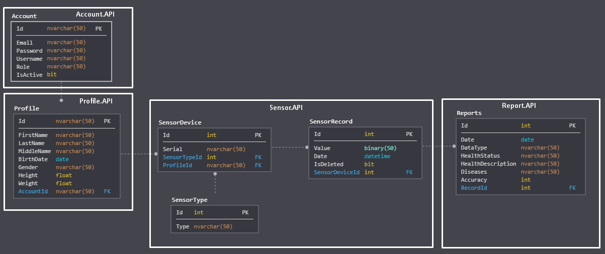

# iCare-Microservices


The main idea of the application is a simulating IoT platform based on microservices for managing patients health.
Application contains the set of services to simulate the collection & transmission of medical telemetry data, set of services for data processing and single-page web application provided user interface for managing patients health.
Each application microservice implements simple CRUD operations.

## Getting Started

### 1. Deploy application microservices

To run the application, type the following commands from the app root directory:

```
> docker-compose build
> docker-compose up
```

For Mac Os or Linux systems, use `sudo` for command above.
To know more about docker-compose, please visit [docker official site](https://docs.docker.com/compose/).

### 2. Configure DataSource microservices

To configure Data source microservice for generating telemetry data, see DataSource [documentation](./DataSource/README.md).

### 3. Deploy iCare Web App

To deploy web UI application, see [documentation](https://github.com/aslamovyura/iCare-single-page-app/blob/master/README.md).

### 4. Configure additional services

Use Swagger UI service for more information on the microservice API. For example, to analyze API of DataSource microservice, use the following URL:

```
http://localhost:3010/swagger
```

Use Jaeger tracing service to verify that the generated data is sent to microservices through Gateway.API. This service is convenient for analyzing the path of interservice requests.

```
http://localhost:16686
```

## Architecture overview

The reference application is cross-platform and can run on Windows, Linux or macOS. A microservice-oriented architecture with multiple standalone microservices (simple CRUD) is used.

The Http protocol is used for communication between web application and microservices. Communication across multiple microservices is based on the Event Bus with commands & events. The reference application uses the [MassTransit](https://masstransit-project.com/) event bus with [RabbitMQ](https://www.rabbitmq.com/) message broker.


## Microservices overview

Each microservice is completely independent and doesn't know about existence of other microservices.

iCare application consists of the following microservices:

- [x] [iCare Web App](./Web/README.md) - A single-page web application (based on Angular), that provides user interface for managing patient health.
- [x] [DataSource](./DataSource/README.md) - Number of services (currently 2) for modeling the collection & transmission of telemetry data (temperature/acoustic) to a specific API.
- [x] [Identity.API](./Services/Identity/README.md) - Microservice for managing user access to application (producer of JW tokens).
- [x] [Profile.API](./Services/Profile/README.md) - Microsrvice for store and managing patients profiles.
- [x] [API Gateway](./ApiGateway/README.md) - An entry point for the application, used only for routing.
- [x] [Sensor.API](./Services/Sensor/README.md) - Microservice for store and managing telemetry sensors (DataSource) & data records (temperature/acoustic).
- [x] [DataProcessor.API](./Services/DataProcessor/README.md) - Number of microservices (currently 2) for processing telemetry data and creating health reports.
- [x] [Report.API](./Services/Report/README.md) - Microservice for store and managing health reports.
- [x] [Event Bus](./EventBus/README.md) - Microservice used for communication between microservices (allows microservices to send commands & events to each other).

## Database model overview



## Docker containers overview

A separate Docker container is used for each microservice. Brief information on used docker containers is presented below.

| # | Service              | Container name      | Port        |
|---|----------------------|---------------------|-------------|
| 1 | DataSource           | datasource_1.api    | 3010:80     |
| 2 | DataSource           | datasource_2.api    | 3011:80     |
| 3 | Gateway.API          | gateway.api         | 3000:80     |
| 4 | Sensor.API           | sensor.api          | 3001:80     |
| 5 | Report.API           | report.api          | 3002:80     |
| 6 | Profile.API          | profile.api         | 3003:80     |
| 7 | Identity.API         | identity.api        | 3004:80     |
| 8 | DataProcessor.API    | dataprocessor_1.api | 3005:80     |
| 9 | DataProcessor.API    | dataprocessor_2.api | 3006:80     |
| 10| SQL Server           | sqldata             | 1433:1433   |
| 11| Event Bus (Rabbit MQ)| event_bus           | 15672:15672 |
| 12| Tracing service      | jaeger              | 16686:16686 |

## Built with

- [ASP.NET Core 3.1](https://docs.microsoft.com/en-us/aspnet/core/)
- [Microservices](https://docs.microsoft.com/en-us/dotnet/architecture/microservices/) ([CRUD](https://docs.microsoft.com/en-us/iis-administration/api/crud))
- [Clean architecture](https://docs.microsoft.com/en-us/dotnet/architecture/modern-web-apps-azure/common-web-application-architectures)
- [REST API](https://restfulapi.net/) with [Swagger](https://swagger.io/)
- [Docker](https://www.docker.com/)
- [Entity Framework Core](https://docs.microsoft.com/en-us/ef/core/) for [SQL Server](https://www.microsoft.com/en-us/sql-server/sql-server-2019)
- [Automapper](https://automapper.org/)
- [Health check](https://docs.microsoft.com/en-us/aspnet/core/host-and-deploy/health-checks?view=aspnetcore-3.1)
- Unit tests with [xUnit](https://xunit.net/) & [Moq](https://github.com/Moq/moq4/wiki/Quickstart)
- Logging with [Serilog](https://serilog.net/)
- Event bus based on [MassTransit](https://masstransit-project.com/) and [RabbitMQ](https://www.rabbitmq.com/)
- [Open Tracing](https://opentracing.io/) with [Jaeger](https://www.jaegertracing.io/)
- [API Gateway](https://docs.microsoft.com/en-us/azure/architecture/microservices/design/gateway) with [Ocelot](https://github.com/ThreeMammals/Ocelot)

## Author

[Yury Aslamov](https://aslamovyura.github.io/) - Software Developer, Ph.D.

## License

This project is under the MIT License - see the [LICENSE.md](https://github.com/teachmeskills-dotnet/TMS-DotNet02-Aslamov/blob/master/LICENSE) file for details.
